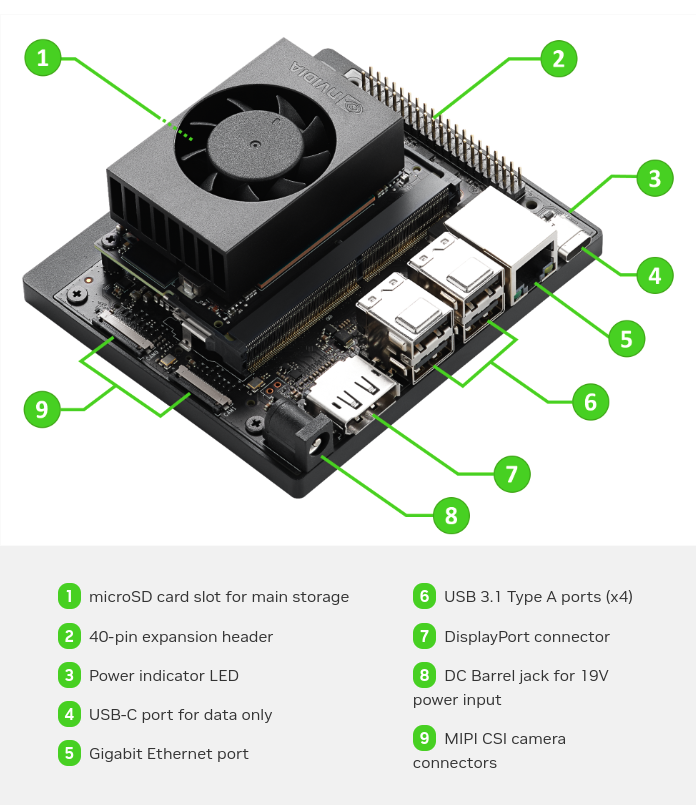

# NVIDIA Jetson Orin Nano

We are using [NVIDIA® Jetson Orin Nano™](https://developer.nvidia.com/embedded/learn/get-started-jetson-orin-nano-devkit#intro) for our project.

## Specifications

- microSD card slot for main storage
- 40-pin expansion header
- Power indicator LED
- USB-C port for data only
- Gigabit Ethernet port
- USB 3.1 Type A ports (x4)
- DisplayPort connector
- DC Barrel jack for 19V power input
- MIPI CSI camera connectors
- Reference carrier board (includes 802.11 plug-in WLAN & BT module preinstalled with antenna)
- 19V power supply

## Useful Links

- [Jetson Orin Nano Developer Kit User Guide](https://developer.nvidia.com/embedded/learn/jetson-orin-nano-devkit-user-guide/index.html)
- [NVIDIA Jetson Developer site](https://developer.nvidia.com/embedded/learn/get-started-jetson-orin-nano-devkit#next)
- [NVIDIA Jetson Forums](https://developer.nvidia.com/embedded/learn/get-started-jetson-orin-nano-devkit#next)

## Communication and Interface

For power supply use power adapter. For communication, use USB-cable.

## Installation and Running

[Setup and First Boot](https://developer.nvidia.com/embedded/learn/get-started-jetson-orin-nano-devkit#setup)
