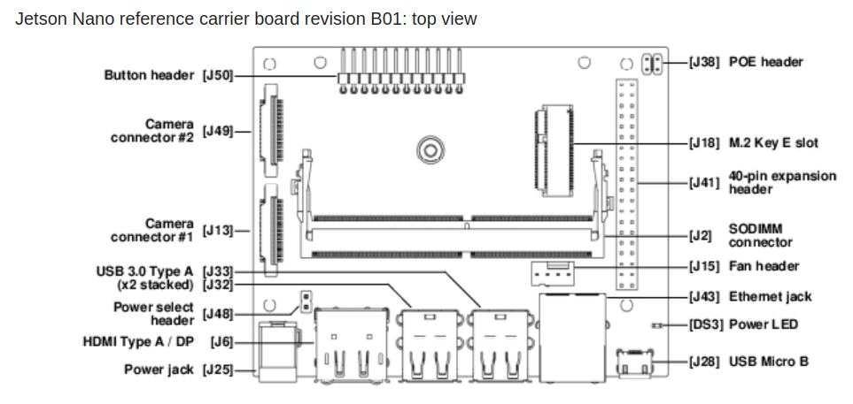
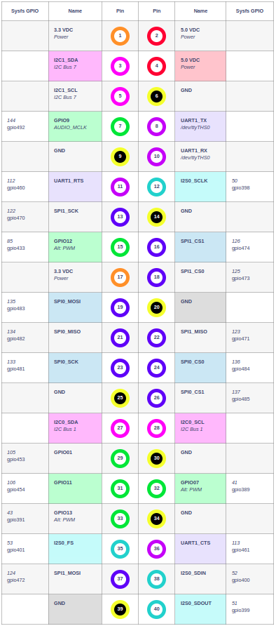

# NVIDIA Jetson Orin Nano

We are using a 4GB [NVIDIA® Jetson Orin Nano™](https://developer.nvidia.com/embedded/learn/get-started-jetson-orin-nano-devkit#intro) for our project. In official documentation, it is referred to as a Jetson Orin Nano Series device.

## Specifications

- 4GB
- microSD card slot for main storage
- 40-pin expansion header
- Power indicator LED
- USB-C port for data only
- Gigabit Ethernet port
- USB 3.1 Type A ports (x4)
- DisplayPort connector
- DC Barrel jack for 19V power input
- MIPI CSI camera connectors
- Reference carrier board (includes 802.11 plug-in WLAN & BT module preinstalled with antenna)
- 19V power supply

## Useful Links

- [Jetson Orin Nano Developer Kit User Guide](https://developer.nvidia.com/embedded/learn/jetson-orin-nano-devkit-user-guide/index.html)
- [NVIDIA Jetson Developer site](https://developer.nvidia.com/embedded/learn/get-started-jetson-orin-nano-devkit#next)
- [NVIDIA Jetson Forums](https://developer.nvidia.com/embedded/learn/get-started-jetson-orin-nano-devkit#next)
- [Jetson Download Center](https://developer.nvidia.com/embedded/downloads#?search=pinmux)
- [Jetson Nano reference carrier board revision B01](https://docs.nvidia.com/jetson/archives/l4t-archived/l4t-3261/index.html#page/Tegra%20Linux%20Driver%20Package%20Development%20Guide/hw_setup.html#wwpID0E0DS0HA)

## Communication and Interface

For power supply use power adapter. For communication, use USB-cable.

## Terms and Abbreviations

- **GPIO**: a general-purpose input/output (GPIO) is an uncommitted digital signal pin on an integrated circuit or electronic circuit (e.g. MCUs/MPUs) board which may be used as an input or output, or both, and is controllable by software. GPIOs have no predefined purpose and are unused by default. If used, the purpose and behavior of a GPIO is defined and implemented by the designer of higher assembly-level circuitry: the circuit board designer in the case of integrated circuit GPIOs, or system integrator in the case of board-level GPIOs.

## Installation and Running

[Setup and First Boot](https://developer.nvidia.com/embedded/learn/get-started-jetson-orin-nano-devkit#setup)

## Expansion Header J12 Pinout

